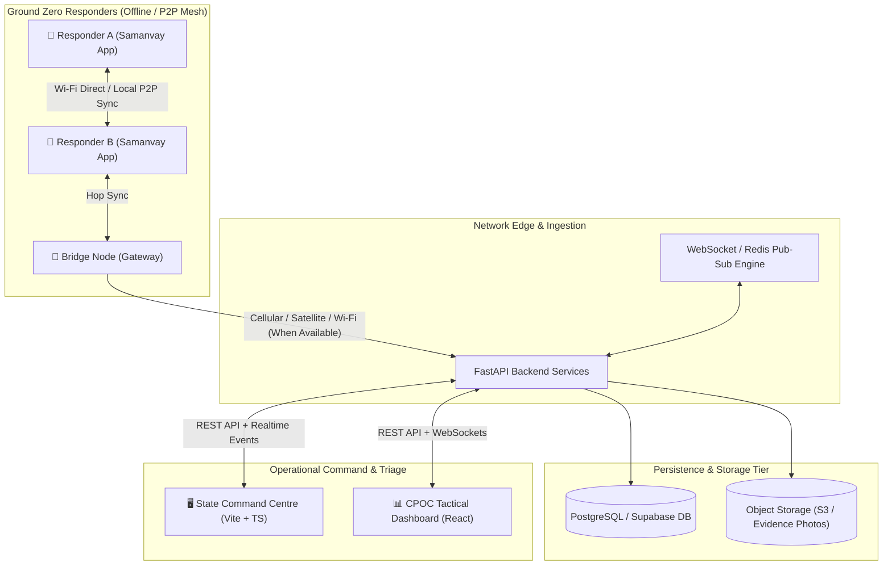

# ONE ROOF 
### Resilient Disaster Response, Offline Mesh Coordination & Command Ecosystem

[](https://flutter.dev)
[](https://fastapi.tiangolo.com)
[](https://reactjs.org)
[](https://www.typescriptlang.org)
[](https://www.postgresql.org)
[](https://redis.io)

---

## 📌 Overview

**ONE ROOF** is an end-to-end, resilient emergency coordination and disaster response platform designed to bridge ground-zero responders, district command nodes, and state disaster management authorities during severe crisis events (such as extreme floods, cyclones, and landslides).

In major natural disasters, conventional cellular and internet infrastructure often suffers complete blackout. **ONE ROOF** addresses this critical single point of failure by uniting **offline-first peer-to-peer (P2P) mesh networking** on mobile devices with an enterprise **FastAPI + Supabase cloud backend** and high-visibility **React / TypeScript State Command Dashboards**.

---

## 🏛️ System Architecture



---

## 🧩 Key Subsystems

### 1. 📱 Samanvay Mobile Responder App (`/lib`)
*Built with Flutter, Dart, and Wi-Fi Direct Mesh Protocols.*
* **Offline-First P2P Sync**: Custom multi-hop store-and-forward sync protocol (`flutter_p2p_connection`, `crypto`, `image`) enabling report and status propagation without active cellular towers.
* **Rapid Incident Triage (P0–P3)**: One-tap creation of emergency reports (trapped casualties, fire, landslides, medical crises, road blockages).
* **Geotagged Evidence Chain**: Cryptographically hashed and geo-tagged camera capture with progressive compression for low-bandwidth relay.
* **Emergency Clocks & Timers**: Real-time tracking of elapsed emergency duration and countdown to recovery phases.
* **Multi-Language Support**: Full English and Malayalam (`ml_IN`) localization (`l10n`).
* **Tactical Bridge Mode & Cycle Tester**: Dedicated testing and diagnostics for verifying P2P discovery, handshake, and multi-node packet propagation.

---

### 2. ⚡ Unified Backend Services (`/backend`)
*Built with FastAPI, Python 3.11+, SQLAlchemy, Redis, and MinIO/S3.*
* **Incident Lifecycle Management**: Centralized ingestion, status tracking (`OPEN`, `ACKNOWLEDGED`, `RESOLVED`, `CLOSED`, `REOPENED`, `DUPLICATE`), and triage.
* **Realtime Pub/Sub Engine**: High-throughput WebSocket broadcasting via Redis pub/sub for instant state synchronization with command centers.
* **Photo Verification & Distance Validation**: Automated spatial verification comparing incident GPS coordinates with photo EXIF metadata to prevent fraud and false closures.
* **Role-Based Access Control (RBAC)**: Fine-grained security for citizens, ground responders, and CPOC command administrators using JWT authentication.
* **Supabase Integration & Migrations (`/supabase`)**: Declarative PostgreSQL schema and migration scripts for areas, users, incidents, units, and evidence logs.

---

### 3. 🗺️ State Command Centre (`/command-centre`)
*Built with React 18, TypeScript, Vite, and Tailwind/Vanilla CSS.*
* **Interactive District Map**: Schematic and GIS-aware SVG operational map with live district status rings (`NORMAL`, `ALERT`, `EMERGENCY`).
* **Incident Worklist & Filters**: Real-time filtering by severity (P0-P3), status, incident category, and assigned agency.
* **Historical Replay & Simulation Engine**: Includes dual modes:
  * *Live Demo*: Fictional multi-agency operational demo.
  * *Kerala 2018 Floods Replay*: Reconstructed historical timeline based on KSDMA/UNDP data for training disaster response operators.
* **CPOC & Multi-Channel Switcher**: Direct communication hooks across phone, email, and district VHF/UHF radio nets.
* **Evidence Lightbox**: Comprehensive photo, telemetry, and timeline audit view for state coordinators.

---

### 4. 📊 CPOC Tactical Dashboard (`/cpoc-dashboard`)
*Built with React and Vite.*
* Dedicated interface for district-level Central Point of Contact (CPOC) coordinators.
* Fast review queue for incoming field reports, duty assignments, unit status tracking, and report approval/rejection workflows.

---

## 🛠️ Technology Stack

| Layer | Technologies |
|---|---|
| **Mobile Client** | Flutter (3.x), Dart, Material 3, `flutter_p2p_connection`, `geolocator`, `camera`, `crypto`, `intl` |
| **Backend API** | FastAPI, Python 3.11+, SQLAlchemy 2.0, Pydantic v2, Uvicorn |
| **Realtime & Queue** | WebSockets, Redis (Pub/Sub & Cache) |
| **Database & Storage** | PostgreSQL 15+, Supabase, AWS S3 / MinIO / Object Storage |
| **Command Centre** | React 18, TypeScript, Vite, Zustand, Lucide Icons |
| **Tactical Dashboard** | React 18, Vite, Modern CSS |
| **Testing & CI** | `flutter_test`, `pytest`, `vitest`, `oxlint`, `eslint` |

---

## 🚀 Getting Started

### Prerequisites
* **Flutter SDK** (>= 3.13.1) & Android SDK (for mobile testing)
* **Python** (>= 3.11) & `pip`
* **Node.js** (>= 18.0) & `npm`
* **Docker & Docker Compose** (optional, for containerized backend)

---

### 1. Running the Mobile Responder App (`Flutter`)
```bash
# Get dependencies
flutter pub get

# Generate localization files
flutter gen-l10n

# Run unit and mesh tests
flutter test

# Launch on connected device or emulator
flutter run
```

---

### 2. Running the Backend API (`FastAPI`)
```bash
cd backend

# Create and activate virtual environment
python -m venv .venv
source .venv/bin/activate # On Windows: .venv\Scripts\activate

# Install dependencies
pip install -r requirements.txt

# Configure environment variables
cp .env.example .env

# Run FastAPI server with hot reload
uvicorn app.main:app --host 0.0.0.0 --port 8000 --reload
```

*Or with Docker Compose:*
```bash
cd backend
docker-compose up --build
```
*API documentation will be available at `http://localhost:8000/docs`.*

---

### 3. Running the State Command Centre (`React + TypeScript`)
```bash
cd command-centre

# Install dependencies
npm install

# Run dev server
npm run dev

# Run quality checks
npm test
npm run lint
npm run build
```
*Command centre will be accessible at `http://localhost:5173/`.*

---

### 4. Running the CPOC Dashboard
```bash
cd cpoc-dashboard

npm install
npm run dev
```

---

## 🧪 Testing Strategy

* **Mobile Mesh & Logic Tests (`/test`)**:
  * P2P Connection Manager state machine tests
  * Store-and-forward mesh packet synchronization & deduplication
  * Bridge mode packet relay & queue lifecycle
  * Emergency clock & localization fidelity
* **Backend Test Suite (`/backend/tests` & `/backend/unit_tests`)**:
  * Comprehensive test suite covering authentication, incident ingestion, photo verification, and WebSocket streaming.
* **Frontend Test Suite (`/command-centre/src/test`)**:
  * Interaction testing for map navigation, district overlays, filter pipelines, and scenario toggles.

---

## 📂 Repository Structure

```text
oneroof/
├── android/                 # Android native config & permissions (Wi-Fi Direct, GPS, Camera)
├── backend/                 # FastAPI backend service
│   ├── app/                 # Routers, models, schemas, and services
│   ├── tests/               # Backend integration and unit tests
│   ├── docker-compose.yml   # Multi-container orchestration (API, DB, Redis, MinIO)
│   └── requirements.txt     # Python dependencies
├── command-centre/          # State Command Centre (React + TypeScript + Vite)
│   ├── src/                 # Map components, incident worklists, simulation engine
│   └── public/              # Static assets and scenario fixtures
├── cpoc-dashboard/          # District CPOC coordinator dashboard (React + Vite)
├── lib/                     # Flutter Samanvay Responder mobile application
│   ├── l10n/                # Localization files (English, Malayalam)
│   ├── mesh/                # P2P mesh network, sync protocols, and device identity
│   ├── screens/             # UI screens (Home, Mesh, Reports, Profile, Create Request)
│   ├── theme/               # Tactical dark theme design system
│   └── widgets/             # Reusable UI widgets & emergency clock
├── supabase/                # Database migrations & configuration
├── test/                    # Flutter unit & mesh simulation tests
└── pubspec.yaml             # Flutter project definition & dependencies
```

---

## 🤝 Contributing

1. Fork the repository
2. Create your feature branch (`git checkout -b feature/resilient-mesh-routing`)
3. Commit your changes (`git commit -m "feat: enhance mesh packet routing"`)
4. Push to the branch (`git push origin feature/resilient-mesh-routing`)
5. Open a Pull Request

---

## 📄 License & Attribution

This project is developed for mission-critical disaster management and humanitarian response coordination.
Historical scenario models are based on public post-disaster assessments and reports published by the **Kerala State Disaster Management Authority (KSDMA)** and the **United Nations Development Programme (UNDP)**.
